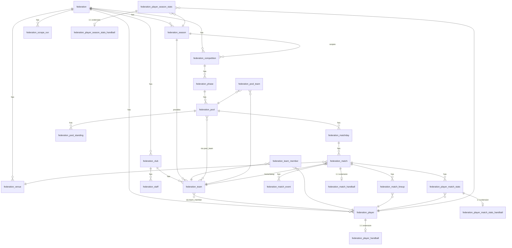

# Modèle de données — Architecture en 3 couches

> Voir le spec de design [`../superpowers/specs/2026-05-17-ffhb-scraping-and-federation-model-design.md`](../superpowers/specs/2026-05-17-ffhb-scraping-and-federation-model-design.md) pour le raisonnement complet.

## Vue d'ensemble

Titan organise ses données en trois couches superposées :

1. **Couche 1 — Référentiel fédéral core (`federation_*`)** : alimenté uniquement par le scrapping. Source de vérité d'identité des entités fédérales (clubs, équipes, joueurs, matchs officiels).
2. **Couche 2 — Extensions sport (`federation_*_<sport>`)** : champs spécifiques à un sport, en 1-1 avec leur entité core (ex : `federation_player_handball` pour les postes et la main de tir).
3. **Couche 3 — App (`titan_*`)** : données SaaS spécifiques aux clubs inscrits sur Titan (cotisations, entraînements, contacts urgence…). Référence la couche 1. *(En cours de refactor — voir Plan 2.)*

**Règle invariante :** les couches 1 et 2 ne sont jamais modifiées par l'utilisateur final. Le scrapper en est la seule source d'écriture.

## Diagramme ER (couches 1 et 2)

## Glossaire des entités

| Entité | Couche | Description courte |
|---|---|---|
| `federation` | 1 | Une fédération sportive (FFHB, FFF…) |
| `federation_season` | 1 | Saison sportive (2024-2025) |
| `federation_venue` | 1 | Gymnase / salle référencée par la fédé |
| `federation_club` | 1 | Club affilié à une fédération |
| `federation_staff` | 1 | Dirigeant ou entraîneur d'un club (scrappé) |
| `federation_team` | 1 | Équipe d'un club pour une saison |
| `federation_team_member` | 1 (pivot) | Affiliation joueur ↔ équipe, historisée |
| `federation_player` | 1 | Licencié (identité fédérale) |
| `federation_competition` | 1 | Championnat, coupe ou tournoi |
| `federation_phase` | 1 | Phase d'une compétition (aller, retour, play-offs) |
| `federation_pool` | 1 | Poule d'une phase |
| `federation_pool_team` | 1 (pivot) | Inscription d'une équipe à une poule |
| `federation_pool_standing` | 1 | Snapshot de classement de poule |
| `federation_matchday` | 1 | Journée (J1, J2, 8e de finale…) |
| `federation_match` | 1 | Match officiel |
| `federation_match_lineup` | 1 | Présence d'un joueur sur la feuille de match |
| `federation_match_event` | 1 | Événement timé (but, sanction, timeout…) |
| `federation_player_match_stats` | 1 | Stats agrégées d'un joueur sur un match |
| `federation_player_season_stats` | 1 | Stats agrégées d'un joueur sur une saison |
| `federation_scrape_run` | 1 (audit) | Trace d'une exécution du scrapper |
| `federation_player_handball` | 2 | Postes + main de tir, spécifique handball |
| `federation_match_handball` | 2 | Mi-temps, prolongation, tirs au but |
| `federation_player_match_stats_handball` | 2 | Stats détaillées (par zone de tir, sanctions) |
| `federation_player_season_stats_handball` | 2 | Cumul saison des stats handball |

## Champs de provenance

Toutes les entités directement scrapées portent : `externalId`, `federationId`, `lastScrapedAt`, `lastScrapeRunId`, `sourceUrl`, `isManual`.
Les entités pivot portent uniquement : `lastScrapedAt`, `lastScrapeRunId`.

L'unicité d'une entité scrapée est `UNIQUE(federationId, externalId)` — clé naturelle qui rend le scrapping idempotent.
