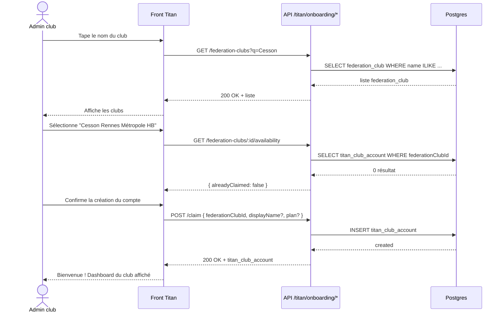

# Workflow d'onboarding club Titan

> Comment un club affilié FFHB s'inscrit sur Titan et rattache ses données.

## Pré-requis

Le club doit déjà exister dans le **référentiel fédéral** (`federation_club`). Deux possibilités :
1. Le scrapper l'a déjà découvert lors d'un sync précédent (cas standard, à venir Plan 3).
2. Un admin Titan crée le `federation_club` manuellement (`isManual: true`) — cas exceptionnel pour les clubs très nouveaux ou les amicaux étrangers.

## Diagramme de séquence

## Endpoints exposés

| Méthode | Chemin | Description |
|---|---|---|
| `GET` | `/api/titan/onboarding/federation-clubs?q=<query>&federation=<code>?` | Recherche par nom partiel ou code externe. Limite 25 résultats. |
| `GET` | `/api/titan/onboarding/federation-clubs/:federationClubId/availability` | Vérifie qu'un club fédéral peut être revendiqué (pas déjà claimé). |
| `POST` | `/api/titan/onboarding/claim` | Crée le `titan_club_account`. Body : `{ federationClubId, displayName?, subscriptionPlan? }` |

Tous protégés par `auth` (utilisateur authentifié). La vérification d'identité du claimeur est volontairement absente pour le MVP — à renforcer plus tard.

## Cas marginaux

- **Club déjà revendiqué** → `POST /claim` retourne `409 Conflict`. À terme, on ajoutera un mécanisme d'invitation/transfert pour gérer les changements de propriétaire.
- **Club introuvable dans le référentiel** → l'utilisateur peut soit attendre le prochain sync FFHB, soit demander à un admin Titan de créer le `federation_club` manuellement.
- **Vérification d'identité** → pour l'instant, n'importe quel utilisateur authentifié peut claimer n'importe quel club. À renforcer plus tard (validation par email du club, code de vérification fédéral, etc.). C'est explicitement hors périmètre de cette implémentation initiale.

## Suite : invitations

Une fois le `titan_club_account` créé, l'admin peut inviter d'autres utilisateurs via `titan_club_invitation` (FK déjà repointée vers `clubAccountId` en Phase F du Plan 2). Le flux d'invitation n'est pas modifié par ce refactor — seul le FK source change.
